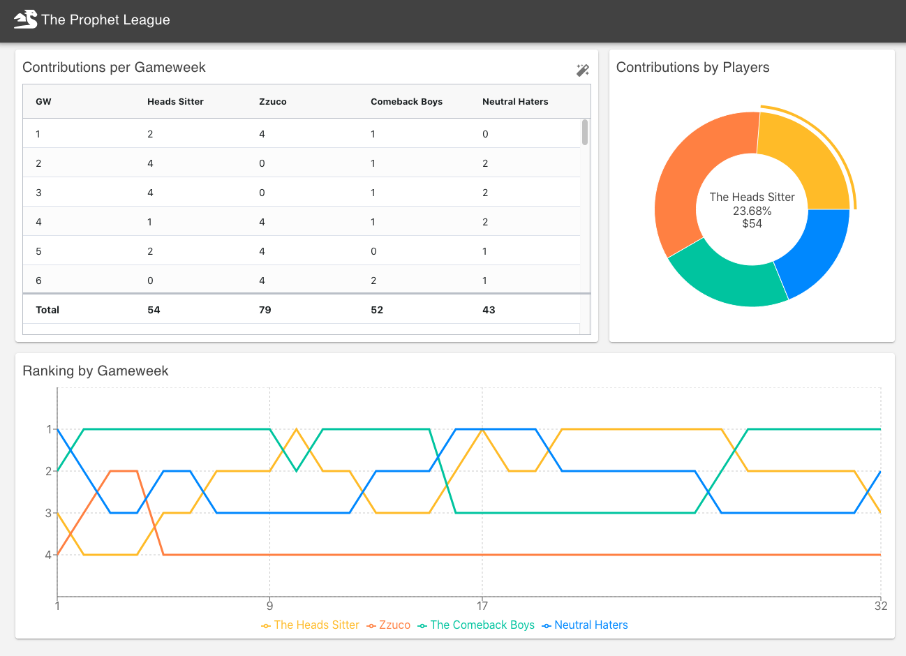

# Prophet League Dashboard

A web application built using ReactJS to keep track of the contributions each participant needs to make to the prize pool as part of their Fantasy Permier League Competition.

This project is built using the following technologies:

1. ReactJS - Web framework
1. Rechart - React based charting library
1. Ag-grid - Datagrid framework
1. Github Actions - CI/CD pipeline for automated deployment to heroku

[Demo](https://prophetleague.herokuapp.com/)
